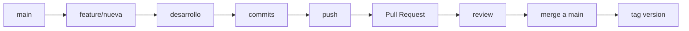

# GitFlow
Documentación referente a metodología para el manejo de versionamientos
# **Research Flow: Guía Completa de Git/GitHub**

> **Metodología simplificada de versionado*

## **📋 Tabla de Contenidos**

- [Introducción](#introducción)
- [¿Qué es Research Flow?](#qué-es-research-flow)
- [Glosario de Comandos](#glosario-de-comandos)
- [Estructura de Branches](#estructura-de-branches)
- [Convenciones de Commits](#convenciones-de-commits)
- [Flujos de Trabajo](#flujos-de-trabajo)
- [Ejemplos Prácticos](#ejemplos-prácticos)
- [Scripts de Automatización](#scripts-de-automatización)
- [Comandos de Emergencia](#comandos-de-emergencia)
- [Mejores Prácticas](#mejores-prácticas)

---

## **🎯 Introducción**

Esta guía está adaptada para el manejo de versionamientos del repositorio [Optical Networking](https://github.com/rudaruza20/opticalnetworking.git/) . **Research Flow** es una metodología simplificada basada en GitHub Flow, adaptada para proyectos académicos con necesidades de:

- ✅ **Reproducibilidad** para publicaciones científicas
- ✅ **Colaboración** eficiente en equipos pequeños
- ✅ **Versionado** claro para diferentes algoritmos
- ✅ **Calidad** mantenida sin overhead excesivo

---

## **🌊 ¿Qué es Research Flow?**

**Research Flow** es una metodología de branching simplificada que mantiene la calidad del código sin la complejidad de GitFlow completo.

### **Filosofía Central**
```
"Simplicidad sin sacrificar calidad"
- Mínimo overhead administrativo
- Máxima flexibilidad para investigación
- Trazabilidad completa para reproducibilidad
```

### **Estructura de Branches**
```
main/                    # ✅ Código estable, listo para publicar
feature/<nombre>         # 🚧 Desarrollo de características
hotfix/<nombre>          # 🚨 Solo para fixes críticos urgentes
paper/<conference>       # 📄 Preparación específica para papers (opcional)
```

---

## **📖 Glosario de Comandos**

### **🔧 Comandos Básicos de Git**

#### **`git clone`**
```bash
git clone https://github.com/usuario/opticalnetworking.git
```
**¿Qué hace?** Descarga una copia completa del repositorio remoto al computador local.  
**Cuándo usar:** Primera vez que se desea interactuar con el proyecto.

#### **`git status`**
```bash
git status
```
**¿Qué hace?** Muestra el estado actual del repositorio local (archivos modificados, agregados, etc.).  
**Cuándo usar:** Antes de hacer commits para ver que cambios se han realizado.

#### **`git add`**
```bash
git add archivo.java                    # Agregar archivo específico
git add SimuladorON_OfflineJoS/        # Agregar carpeta completa
git add .                              # Agregar todos los cambios
```
**¿Qué hace?** Prepara archivos para el commit (los pone en "staging area").  
**Cuándo usar:** Después de hacer cambios y antes de hacer commit.

#### **`git commit`**
```bash
git commit -m "feat(OfflineJoS): improve MIMO optimization algorithm"
```
**¿Qué hace?** Guarda los cambios preparados con `git add` en el historial local.  
**Cuándo usar:** Cuando se quiera guardar un conjunto lógico de cambios.

#### **`git push`**
```bash
git push origin feature/mimo-improvements
```
**¿Qué hace?** Sube los commits locales al repositorio remoto (GitHub).  
**Cuándo usar:** Para enviar los cambios del repositorio local al repositorio remoto.

#### **`git pull`**
```bash
git pull origin main
```
**¿Qué hace?** Descarga y combina los últimos cambios del repositorio remoto.  
**Cuándo usar:** Antes de empezar a trabajar, para tener la versión más reciente.

#### **`git checkout`**
```bash
git checkout main                      # Cambiar a branch main
git checkout -b feature/nueva-feature  # Crear y cambiar a nueva branch
```
**¿Qué hace?** Cambia entre branches o crea nuevas branches.  
**Cuándo usar:** Para trabajar en diferentes características o versiones.

#### **`git merge`**
```bash
git merge feature/nueva-feature
```
**¿Qué hace?** Combina los cambios de una branch con la branch actual.  
**Cuándo usar:** Para integrar una característica completada.

#### **`git branch`**
```bash
git branch                    # Ver todas las branches
git branch -d feature/old     # Eliminar branch
```
**¿Qué hace?** Gestiona las branches del repositorio.  
**Cuándo usar:** Para organizar y limpiar el flujo de ramificación.

#### **`git tag`**
```bash
git tag -a v1.1.0 -m "Add MIMO improvements"
```
**¿Qué hace?** Marca un punto específico en el historial como una versión.  
**Cuándo usar:** Para marcar releases o versiones importantes. OJO: ESTE COMANDO SERVIRÁ PARA DISTINGUIR LOS VERSIONAMIENTOS DE CADA SIMULADOR

### **🌐 Conceptos de GitHub**

#### **Pull Request (PR)**
**¿Qué es?** Una solicitud para revisar y combinar cambios de una branch a otra.  
**¿Para qué?** Revisión de código, discusión, y control de calidad antes del merge.

#### **Issues**
**¿Qué es?** Sistema de tickets para reportar bugs, solicitar características, etc.  
**¿Para qué?** Organizar el trabajo y hacer seguimiento de problemas.

---

## **🌳 Estructura de Branches**

### **Branches Permanentes**

#### **🔴 Main Branch**
- **Propósito**: Código estable, siempre funcional
- **Características**: 
  - ✅ Siempre compilable y desplegable
  - ✅ Solo recibe merges via Pull Request
  - ✅ Cada merge puede ser una nueva versión
  - ✅ Protegida contra commits directos

### **Branches Temporales**

#### **🟢 Feature Branches**
```bash
feature/<nombre-caracteristica>
feature/mimo-optimization
feature/uwb-improvements  
feature/rmtsa-implementation
```

- **Origen**: `main`
- **Destino**: `main` (via Pull Request)
- **Propósito**: Desarrollar nuevas características
- **Duración**: Días a semanas máximo

#### **🔴 Hotfix Branches**
```bash
hotfix/<descripcion>
hotfix/memory-leak-fix
hotfix/critical-bug-allpaths
```

- **Origen**: `main`
- **Destino**: `main` (merge directo permitido)
- **Propósito**: Arreglos críticos urgentes
- **Duración**: Horas a días

#### **📄 Paper Branches (Opcional)**
```bash
paper/<conference>
paper/ieee-conference-2024
paper/optics-express-submission
```

- **Origen**: `main`
- **Destino**: `main`
- **Propósito**: Preparación específica para publicaciones
- **Duración**: Según timeline de conferencia

---

## **📝 Convenciones de Commits**

### **Formato Estándar**
```
<tipo>(<simulador>): <descripción>

[cuerpo opcional con más detalles]

[footer opcional con referencias]
```

### **Tipos Permitidos**
- **`feat`**: Nueva funcionalidad
- **`fix`**: Corrección de bug
- **`perf`**: Mejoras de performance
- **`docs`**: Cambios en documentación
- **`test`**: Agregar o modificar tests
- **`refactor`**: Refactorización sin cambio funcional
- **`style`**: Cambios de formato (espacios, etc.)
- **`chore`**: Tareas de mantenimiento

### **Simuladores (Scopes)**
- **`OfflineJoS`**: SimuladorON_OfflineJoS
- **`RMTSA`**: SimuladorOn_RMTSA
- **`UWB`**: SimuladorON_Online_UWB
- **`JoS`**: SimuladorON_Online_SDM_EON_JoS
- **`GSw`**: SimuladorON_Online_SDM_EON_GSw
- **`core`**: Clases compartidas

### **Ejemplos de Commits**
```bash
feat(OfflineJoS): add two-stage MIMO optimization
fix(UWB): resolve memory leak in AllDistinctPaths  
perf(RMTSA): optimize ILP convergence by 25%
docs: update README with new simulator instructions
test(core): add integration tests for Network class
```

---

## **🔄 Flujos de Trabajo**

### **Flujo Normal de Desarrollo**



### **Pasos Detallados**

#### **1. Iniciar Nueva Característica**
```bash
git checkout main
git pull origin main
git checkout -b feature/descripcion-clara
```

#### **2. Desarrollo Iterativo**
```bash
# Hacer cambios...
git add archivos-especificos
git commit -m "tipo(scope): descripción clara"
git push origin feature/descripcion-clara
```

#### **3. Pull Request**
- Crear PR en GitHub
- Descripción detallada del cambio
- Solicitar review del equipo
- Ejecutar tests si están configurados

#### **4. Merge y Limpieza**
```bash
git checkout main
git pull origin main
git branch -d feature/descripcion-clara
git tag v1.x.x -m "Descripción del release" # Si aplica
```

---

## **💡 Ejemplos Prácticos**

### **🔧 Ejemplo 1: Mejora en Simulador Existente**

**Escenario**: Optimizar parámetros CPLEX en `SimuladorON_OfflineJoS`

```bash
# 1. Preparar workspace
cd opticalnetworking
git checkout main
git pull origin main
git checkout -b feature/mimo-cplex-parameters

# 2. Hacer cambios en EON_SDM_ILP1_MIMO.java
# Optimizar parámetros deprecados de CPLEX

# 3. Commit con mensaje descriptivo
git add SimuladorON_OfflineJoS/src/dac/cba/simulador/EON_SDM_ILP1_MIMO.java
git commit -m "perf(OfflineJoS): optimize CPLEX parameters in MIMO ILP

- Reemplazo de métodos deprecados con sus equivalentes
- Actualización de MIP gap tolerance de 0.02 a 0.01
- Reducción del tiempo límite de ejecución de 12h a 2h  
"

# 4. Push y crear PR
git push -u origin feature/mimo-cplex-parameters
# Crear Pull Request en GitHub

# 5. Después del merge
git checkout main
git pull origin main
git branch -d feature/mimo-cplex-parameters
git tag v1.0.1 -m "Version del simulador con parámetros equivalentes"
```

### **🆕 Ejemplo 2: Nuevo Simulador**

**Escenario**: Agregar `SimuladorON_RMTSA`

```bash
# 1. Crear feature branch
git checkout -b feature/ml-rmtsa-simulator

# 2. Crear estructura
mkdir SimuladorON_RMTSA
# Copiar archivos base del OfflineJoS
# Adaptar para algoritmos ML

# 3. Commits incrementales
git add SimuladorON_RMTSA/
git commit -m "feat(MLRMTSA): creación de estructura base y clases principales"

git add SimuladorON_RMTSA/src/dac/cba/simulador/SimuladorRMTSA.java
git commit -m "feat(MLRMTSA): añadir directorio base del simulador"

git add SimuladorON_ML_RMTSA/src/dac/cba/simulador/EON_RMTSA_ILP1.java
git commit -m "feat(MLRMTSA): implementación de primer ILP"

# 4. Documentación y tests
git add SimuladorON_ML_RMTSA/README.md
git commit -m "docs(MLRMTSA): Documentación de clases principales"

# 5. Finalizar
git push -u origin feature/ml-rmtsa-simulator
# Pull Request → Review → Merge
git tag v1.2.0 -m "Implementación de simulador RMTSA"
```

### **🐛 Ejemplo 3: Hotfix Crítico**

**Escenario**: Memory leak en `AllDistinctPaths.java`

```bash
# 1. Hotfix branch desde main
git checkout main
git pull origin main
git checkout -b hotfix/memory-leak-allpaths

# 2. Identificar y corregir el problema
# Agregar cleanup en AllDistinctPaths.java
# Actualizar Simulador.java para usar cleanup

# 3. Commit del fix
git add SimuladorON_OfflineJoS/src/dac/cba/simulador/AllDistinctPaths.java
git add SimuladorON_OfflineJoS/src/dac/cba/simulador/Simulador.java
git commit -m "fix(OfflineJoS): resolve critical memory leak in AllDistinctPaths

Root cause: ArrayList instances not cleared between computations
causing memory accumulation in large networks.

Changes:
- Add explicit cleanup() method
- Clear references after computation  
- Update Simulador to call cleanup

Impact: 85% memory usage reduction in large networks
Fixes: OutOfMemoryError in 15+ node networks"

# 4. Merge expedito
git push -u origin hotfix/memory-leak-allpaths
# Pull Request urgente → Merge inmediato
git checkout main
git pull origin main
git tag v1.0.1 -m "Critical hotfix: memory leak in path computation"
```
---

## **🆘 Comandos de ayuda por situaciones anómalas**

### **"¡Errores en el último commit!"**
```bash
# Si NO has hecho push todavía:
git commit --amend -m "Mensaje corregido"

# Si YA hiciste push:
git revert HEAD  # Crea nuevo commit que deshace el anterior
git push origin branch-name
```

### **"¡Rama equivocada!"**
```bash
# Mover cambios sin commit a otra branch:
git stash                     # Guardar cambios temporalmente
git checkout branch-correcta  # Cambiar a branch correcta  
git stash pop                # Restaurar cambios
```

### **"¡Deshacer cambios!"**
```bash
# Deshacer cambios no committed en archivo específico:
git checkout -- archivo.java

# Deshacer TODOS los cambios no committed:
git reset --hard HEAD

# Volver a commit anterior (¡CUIDADO!):
git log --oneline            # Ver historial
git reset --hard abc123      # Volver a commit abc123
```

### **"¡Conflictos de merge!"**
```bash
# Durante un merge con conflictos:
git status                   # Ver archivos en conflicto
# Editar archivos manualmente para resolver conflictos
git add archivo-resuelto.java
git commit -m "resolve merge conflict in archivo-resuelto.java"
```

### **"¡El repositorio posee varios conflictos!"**
```bash
# Último recurso - empezar de nuevo:
cd ..
git clone https://github.com/usuario/opticalnetworking.git backup
# Copiar tus cambios importantes del directorio original
```

---

## **✅ Mejores Prácticas**

### **✅ Hacer Siempre**
- **Commits pequeños y frecuentes** con mensajes descriptivos
- **Pull antes de push** para evitar conflictos
- **Feature branches** para todo cambio no trivial
- **Pull Requests** para revisión de código
- **Testing local** antes de hacer push
- **Limpiar branches** después del merge
- **Tags** para versiones importantes

### **❌ Evitar Siempre**
- Commits directos a `main` (salvo emergencias)
- Feature branches de más de 2 semanas
- Mensajes de commit vagos ("fix", "update")
- `git add .` sin revisar qué se agrega
- Dejar branches sin limpiar
- Hacer push sin testing local

### **⚠️ Con Precaución**
- `git push --force` (en este caso no aplica debido a la protección de ramas, pero se puede tomar en cuenta utilizar si se tiene claro lo que se está enviando)
- `git reset --hard` (se puede perder cambios no almacenados)
- Merge de branches muy desactualizadas
- Cambios en archivos de configuración del IDE

---

## **Versionado Semántico (OPCIONAL)**

### **Formato: `vMAJOR.MINOR.PATCH`**

```
v1.0.0 - Release inicial con SimuladorON_OfflineJoS
v1.1.0 - Agregar SimuladorOn_RMTSA  
v1.1.1 - Hotfix memory leak crítico
v1.2.0 - Agregar SimuladorON_ML_Enhanced
v2.0.0 - Refactorización mayor de arquitectura
```

**Criterios de Incremento:**
- **MAJOR**: Cambios incompatibles, nueva arquitectura
- **MINOR**: Nuevos simuladores, funcionalidades compatibles  
- **PATCH**: Bugfixes, mejoras menores

---

## **Checklist de Referencia**

### **Antes de Empezar Trabajo**
- [ ] `git checkout main`
- [ ] `git pull origin main`
- [ ] `git status` (verificar workspace limpio)
- [ ] `git checkout -b feature/nombre-descriptivo`

### **Durante el Desarrollo**
- [ ] `git status` (frecuentemente)
- [ ] `git add` archivos específicos (no todo)
- [ ] `git commit -m` con mensaje descriptivo
- [ ] `git push origin branch-name` (backup)

### **Antes de Pull Request**
- [ ] Testing completo local
- [ ] Compilación exitosa
- [ ] Documentación actualizada si es necesario
- [ ] Commit message completo y claro

### **Después del Merge**
- [ ] `git checkout main`
- [ ] `git pull origin main`
- [ ] `git branch -d feature/branch-name`
- [ ] `git tag` si es release importante
- [ ] Limpiar branches remotas si es necesario

---

## **🎓 Recursos Adicionales**

### **Documentación Oficial**
- [Git Documentation](https://git-scm.com/doc)
- [GitHub Guides](https://guides.github.com/)
- [Conventional Commits](https://www.conventionalcommits.org/)

### **Herramientas Recomendadas**
- **Git GUI**: SourceTree, GitKraken, GitHub Desktop
- **IDE Integration**: VS Code Git, IntelliJ Git
- **Línea de Comandos**: Git Bash (Windows), Terminal (Mac/Linux)

### **Configuración Inicial Recomendada (En casos cuando ya no se utilice eclipse)**
```bash
# Configurar identidad
git config --global user.name "Tu Nombre"
git config --global user.email "tu.email@universidad.edu"

# Configurar editor por defecto
git config --global core.editor "code --wait"  # VS Code
# git config --global core.editor "nano"       # Nano (alternativa)

# Configurar push behavior
git config --global push.default simple

# Configurar pull behavior  
git config --global pull.rebase false
```

**¡Redactada por [martinizin](https://github.com/martinizin/)! 🚀**

> Esta es una guía preliminar. Si encuentras casos no cubiertos o mejoras, por favor contribuye actualizando este documento.
